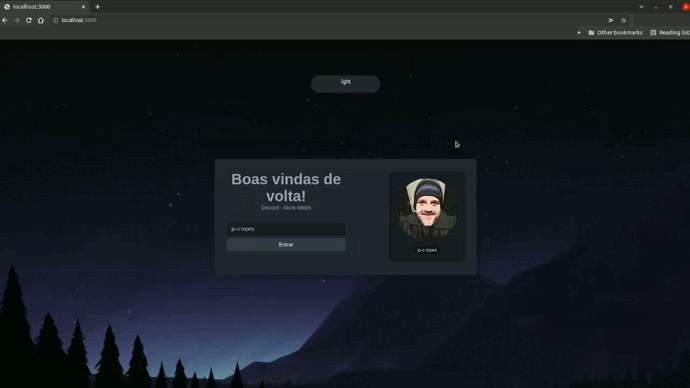

# Aluracord

Um projeto da Imersão React, pela escola <a href="https://www.alura.com.br/" target="_blank">Alura</a>

 

Com professores <a href="https://github.com/omariosouto">Mario Souto</a> e <a href="https://github.com/peas">Paulo Silveira</a>

 

* Minha personalização: 
    * Utilizando useState, foi criado um botão para escurecer e clarear o layout (dark | light)

 
